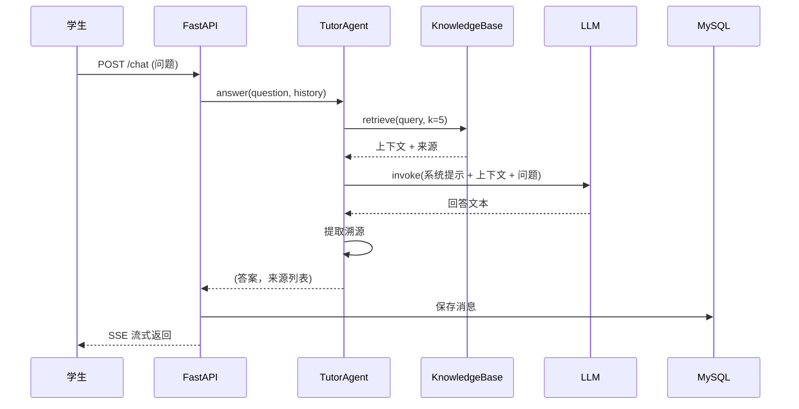

# 基于 Agent 的课程助教系统 - 开发框架详细说明

## 📋 目录

1. [项目概述](#1-项目概述)
2. [技术架构](#2-技术架构)
3. [目录结构](#3-目录结构)
4. [核心模块详解](#4-核心模块详解)
5. [数据流设计](#5-数据流设计)
6. [修改指南](#6-修改指南)

---

## 1. 项目概述

### 1.1 项目定位
这是一个**毕业设计演示系统**，实现基于多 Agent 协作的课程助教功能，完成**答疑/批改/出题**闭环。

### 1.2 核心特性
- **三 Agent 协作**：答疑 Agent、批改 Agent、出题 Agent
- **RAG 知识库**：基于 FAISS 向量检索 + 引用溯源
- **LangGraph 编排**：有状态的多 Agent 工作流
- **Function Calling**：大模型自主工具调用
- **角色权限**：学生/教师/管理员三级 RBAC

---

## 2. 技术架构

### 2.1 技术栈总览

| 层级 | 技术选型 | 版本 | 说明 |
|------|---------|------|------|
| **后端框架** | FastAPI | 0.115.6 | 异步 Web 框架 |
| **ORM** | SQLAlchemy | 2.0.36 | 数据库对象映射 |
| **数据库** | MySQL 8.0 | - | 关系型数据存储 |
| **Agent 框架** | LangChain + LangGraph | 0.3.14 + 0.2.60 | 多 Agent 编排 |
| **向量库** | FAISS | 1.9.0 | 相似度检索 |
| **Embedding** | Qwen-Embedding | v4 | 文本向量化 |
| **大模型** | Qwen-Plus | - | 阿里云百炼 API |
| **前端** | Vue 3 + Vite + TypeScript + Pinia | 3.5+ | 单页应用（SPA），见 ADR-007 |
| **会话** | Redis (可降级 fakeredis) | 5.2.1 | 用户会话管理，见 ADR-008 |

### 2.2 架构分层图

```
┌─────────────────────────────────────────────────────────┐
│              前端层 (Vue 3 SPA / Vite)                    │
│  LoginView | ChatView | DashboardView | KnowledgeView   │
│  Pinia (auth/chat) · Vue Router (角色守卫)               │
├─────────────────────────────────────────────────────────┤
│         Vite Dev Proxy  (/api · /auth)                   │
├─────────────────────────────────────────────────────────┤
│                     API 路由层 (FastAPI)                  │
│  /api/chat | /api/knowledge | /api/grading | ...        │
├─────────────────────────────────────────────────────────┤
│                    业务逻辑层 (Agents)                    │
│  TutorAgent | GraderAgent | QuestionAgent | LangGraph  │
├─────────────────────────────────────────────────────────┤
│                    服务层 (Services)                      │
│  LLM 封装 | Embedding | 知识库检索 | Redis 会话          │
├─────────────────────────────────────────────────────────┤
│                    数据访问层 (Models)                    │
│  SQLAlchemy ORM | 16 张表 | MySQL                        │
└─────────────────────────────────────────────────────────┘
```

---

## 3. 目录结构

### 3.1 完整目录树

```
D:\Demo/
├── app/                          # 应用主目录
│   ├── __init__.py
│   ├── main.py                   # FastAPI 入口，注册路由 + 页面渲染
│   │
│   ├── agents/                   # 【核心】Agent 实现
│   │   ├── graph.py              # LangGraph 编排图（状态机）
│   │   ├── tutor_agent.py        # 答疑 Agent（RAG+ 溯源）
│   │   ├── grader_agent.py       # 批改 Agent（评分 + 评语）
│   │   ├── question_agent.py     # 出题 Agent（试题生成）
│   │   └── orchestrator.py       # 编排器（预留）
│   │
│   ├── api/                      # 【接口】RESTful API
│   │   ├── auth.py               # 认证/登录/注册
│   │   ├── chat.py               # 聊天会话接口
│   │   ├── knowledge.py          # 知识库上传/检索
│   │   ├── grading.py            # 作业批改接口
│   │   ├── question.py           # 试题管理接口
│   │   ├── dashboard.py          # 仪表盘数据
│   │   ├── practice.py           # 练习接口
│   │   ├── courses.py            # 课程管理
│   │   ├── accounts.py           # 账号管理
│   │   ├── logs.py               # 日志接口
│   │   └── agents.py             # Agent 配置接口
│   │
│   ├── core/                     # 【核心】基础设置
│   │   ├── config.py             # 配置加载（.env → Settings）
│   │   ├── database.py           # 数据库连接 + SessionLocal
│   │   ├── deps.py               # 依赖注入（get_db, get_user）
│   │   ├── session.py            # 会话管理（Redis，降级 fakeredis）
│   │   └── course_deps.py        # 课程 RBAC 依赖
│   │
│   ├── kb/                       # 【核心】知识库
│   │   └── knowledge_base.py     # FAISS 索引 + 文档切分 + 检索
│   │
│   ├── models/                   # 【数据】ORM 模型
│   │   ├── models.py             # 16 张表 ORM 定义
│   │   └── ai_provider.py        # AI 服务商配置表
│   │
│   ├── schemas/                  # 【数据】Pydantic 模型
│   │   └── schemas.py            # 请求/响应验证
│   │
│   ├── services/                 # 【服务】LLM 封装
│   │   └── llm.py                # ChatOpenAI + Embeddings 工厂
│   │
│   ├── templates/                # 【已废弃】旧 Jinja2 模板（已移除，见 ADR-003/007）
│   │
│   ├── static/                   # 【前端】静态资源（旧 Jinja2 遗留，前端已迁移至 Vue 3）
│   │   ├── css/
│   │   └── js/
│   │
│   └── utils/                    # 【工具】辅助函数
│       ├── crypto.py             # 密码哈希
│       ├── helpers.py            # 通用辅助
│       └── logging.py            # 系统日志
│
├── frontend/                     # 【前端】Vue 3 SPA 工程
│   ├── src/
│   │   ├── views/                # 页面组件（LoginView, ChatView, ...）
│   │   ├── layouts/              # 布局组件（DashboardLayout）
│   │   ├── stores/               # Pinia 状态管理（auth, chat）
│   │   ├── router/               # Vue Router（角色守卫）
│   │   ├── utils/                # Axios 请求封装等
│   │   └── components/           # 可复用组件
│   ├── vite.config.ts            # Vite 配置（含 /api · /auth 代理）
│   └── package.json
│
├── database/                     # 【数据库】SQL 脚本
│   ├── schema.sql                # 建表脚本（16 张表）
│   └── seed.sql                  # 种子数据
│
├── data/                         # 【数据】运行时数据
│   ├── seed_kb/                  # 演示知识库
│   ├── uploads/                  # 上传文件
│   └── faiss_index/              # 向量索引持久化
│
├── tests/                        # 单元测试（pytest）
├── scripts/                      # 辅助脚本
├── .env                          # 环境变量（密钥，勿提交）
├── .env.example                  # 环境变量模板
├── requirements.txt              # Python 依赖
├── pyproject.toml                # 项目配置
└── README.md                     # 项目说明
```

---

## 4. 核心模块详解

### 4.1 Agent 模块 (`app/agents/`)

#### 4.1.1 LangGraph 编排图 (`graph.py`)

**作用**：将三个 Agent 纳入有状态工作流

```python
# 状态定义
class AgentState(TypedDict, total=False):
    question: str          # 用户问题
    history: list          # 对话历史
    messages: list         # LangChain 消息历史
    intent: str            # 路由结果
    result: dict           # 执行结果
    kb: object             # 知识库句柄

# 路由逻辑
ROUTE_KEYWORDS = {
    "答疑 Agent": ["答疑", "问题", "不会", "讲解", "概念", ...],
    "批改 Agent": ["批改", "评分", "作业", "评语", ...],
    "出题 Agent": ["出题", "试题", "测验", "题目", ...],
}

# 图结构
router → 条件边 → 答疑 Agent/批改 Agent/出题 Agent → END
```

**修改点**：
- 添加新 Agent 节点：`_builder.add_node("新 Agent", 新节点函数)`
- 修改路由关键词：扩展 `ROUTE_KEYWORDS` 字典
- 添加工具调用：在 `TOOLS` 列表注册新工具

#### 4.1.2 答疑 Agent (`tutor_agent.py`)

**核心流程**：
```
用户问题 → 检索知识库 (FAISS) → 组装上下文 → 调用 LLM → 提取溯源 → 返回答案
```

**关键方法**：
| 方法 | 说明 |
|------|------|
| `answer()` | 普通回答 |
| `answer_with_sources()` | 带溯源的回答 |
| `stream()` | SSE 流式输出 |

**修改点**：
- 调整系统提示词：修改 `SYSTEM_PROMPT`
- 更换检索策略：修改 `query_sources()` 调用
- 支持多轮对话：扩展 `_to_role_messages()` 历史处理

#### 4.1.3 批改 Agent (`grader_agent.py`)

**输入**：学生作业文本  
**输出**：`{"score": int, "feedback": str}`

**修改点**：
- 调整评分标准：修改 `SYSTEM_PROMPT`
- 支持多维度评分：扩展返回 JSON 结构

#### 4.1.4 出题 Agent (`question_agent.py`)

**输入**：知识点、数量、难度、课程名  
**输出**：试题列表（JSON 数组）

**修改点**：
- 调整题型分布：修改 `SYSTEM_PROMPT` 中的输出格式
- 增加题型：扩展 `type` 枚举（choice/fill/short）

---

### 4.2 知识库模块 (`app/kb/`)

#### 4.2.1 KnowledgeBase 类

**核心功能**：
```python
class KnowledgeBase:
    def __init__(self, course_id: int)      # 按课程加载索引
    def add_document(text, source)          # 添加文档 → 切分 → 向量化
    def retrieve(query, k=5)                # 相似度检索
    def save()                              # 持久化 FAISS 索引
```

**向量索引路径**：`data/faiss_index/course_{course_id}/`

#### 4.2.2 文档处理流程

```
上传文件 → 解析文本 → 切分 (500 字/块，50 字重叠) → 向量化 → FAISS 索引 → MySQL 元数据
```

**支持格式**：
- `.txt`, `.md`：直接读取
- `.pdf`：`pypdf` 解析
- 扩展：在 `SUPPORTED_EXTS` 中添加解析逻辑

---

### 4.3 服务层 (`app/services/`)

#### 4.3.1 LLM 工厂 (`llm.py`)

**核心类**：`LLMFactory`

```python
# 创建聊天模型
chat_model = LLMFactory.chat_model(model="qwen-plus")

# 创建 Embedding 客户端
embeddings = LLMFactory.embeddings(model="text-embedding-v4")
```

**修改点**：
- 切换大模型供应商：修改 `_PROVIDER` 或添加新分支
- 调整模型参数：修改 `temperature`, `max_tokens`, `timeout`
- 添加新模型：在 `chat_model()` 中扩展条件分支

---

### 4.4 核心配置 (`app/core/`)

#### 4.4.1 配置管理 (`config.py`)

```python
class Settings:
    # 大模型配置
    LLM_API_KEY = os.getenv("QWEN_API_KEY")
    LLM_BASE_URL = os.getenv("QWEN_BASE_URL")
    LLM_CHAT_MODEL = os.getenv("QWEN_CHAT_MODEL")
    LLM_EMBEDDING_MODEL = os.getenv("QWEN_EMBEDDING_MODEL")
    
    # MySQL 配置
    MYSQL_HOST = os.getenv("MYSQL_HOST")
    MYSQL_PORT = int(os.getenv("MYSQL_PORT"))
    MYSQL_USER = os.getenv("MYSQL_USER")
    MYSQL_PASSWORD = os.getenv("MYSQL_PASSWORD")
    MYSQL_DB = os.getenv("MYSQL_DB")
    
    # 数据库连接串
    SQLALCHEMY_DATABASE_URL = f"mysql+pymysql://{USER}:{PASS}@{HOST}:{PORT}/{DB}"
```

#### 4.4.2 数据库连接 (`database.py`)

```python
engine = create_engine(settings.SQLALCHEMY_DATABASE_URL)
SessionLocal = sessionmaker(autocommit=False, autoflush=False, bind=engine)
Base = declarative_base()

def get_db():
    db = SessionLocal()
    try:
        yield db
    finally:
        db.close()
```

#### 4.4.3 会话管理 (`session.py`)

**Redis 会话存储**（见 ADR-008）：
```python
class SessionStore:
    def __init__(self, host, port, db, ttl)     # 连接 Redis
    def create_session(user_id, real_name, role) -> token   # Hash + EXPIRE
    def get_session(token) -> session_data      # HGETALL + TTL 校验
    def destroy_session(token)                  # DELETE
    def extend_session(token) -> bool           # 续期

# 降级：开发环境 Redis 连接失败时自动切换 fakeredis
```

环境变量：`REDIS_HOST` / `REDIS_PORT` / `REDIS_DB` / `SESSION_TTL`

---

### 4.5 数据模型 (`app/models/`)

#### 4.5.1 16 张表分类

| 分类 | 表名 | 说明 |
|------|------|------|
| **用户体系** | users, students, teachers | 用户 + 角色扩展 |
| **课程体系** | courses, course_users, enrollments | 课程 + 成员关系 |
| **知识库** | knowledge_docs, knowledge_chunks | RAG 文档 + 切块 |
| **会话消息** | sessions, messages | 对话历史 + 溯源 |
| **作业批改** | assignments, submissions, grading_records | 作业全流程 |
| **试题学情** | questions, learning_records | 试题 + 答题记录 |
| **系统配置** | agent_configs, system_logs | Agent 配置 + 审计日志 |

#### 4.5.2 关键关系

```
users (1) ── (N) course_users (N) ── (1) courses
users (1) ── (N) enrollments (N) ── (1) courses
courses (1) ── (N) knowledge_docs
knowledge_docs (1) ── (N) knowledge_chunks
sessions (1) ── (N) messages
assignments (1) ── (N) submissions (1) ── (1) grading_records
```

---

### 4.6 API 路由 (`app/api/`)

| 路由文件 | 前缀 | 功能 |
|---------|------|------|
| `auth.py` | /api/auth | 登录/注册/登出 |
| `chat.py` | /api/chat | 聊天会话 CRUD |
| `knowledge.py` | /api/knowledge | 知识库检索 |
| `grading.py` | /api/grading | 作业批改提交 |
| `question.py` | /api/question | 试题管理 |
| `dashboard.py` | /api/dashboard | 仪表盘统计 |
| `practice.py` | /api/practice | 学生练习 |
| `courses.py` | /api/courses | 课程 CRUD |
| `agents.py` | /api/agents | Agent 配置 |
| `logs.py` | /api/logs | 系统日志 |

---

## 5. 数据流设计

### 5.1 答疑流程



### 5.2 知识库上传流程

```
上传文件 → 解析文本 → 切分 → 向量化 → FAISS 索引 → MySQL 元数据
   ↓
KnowledgeBase.add_document() → save() → 持久化到 data/faiss_index/
```

### 5.3 LangGraph 执行流程

```
入口 → router_node (路由) → 条件边 → Agent 节点 → tool 节点 (可选) → END
```

---

## 6. 修改指南

### 6.1 添加新 Agent

**步骤**：

1. **在 `app/agents/` 创建新 Agent 文件**
   ```python
   # app/agents/new_agent.py
   def new_agent_function(input: str) -> dict:
       # 实现逻辑
       return {"result": "..."}
   ```

2. **在 `graph.py` 注册节点**
   ```python
   from app.agents.new_agent import new_agent_function
   
   def new_node(state: AgentState) -> AgentState:
       return {**state, "result": new_agent_function(state["question"])}
   
   _builder.add_node("新 Agent", new_node)
   _builder.add_edge("新 Agent", END)
   ```

3. **扩展路由关键词**
   ```python
   ROUTE_KEYWORDS["新 Agent"] = ["关键词 1", "关键词 2"]
   ```

4. **在 `main.py` 添加 API 路由**（如需独立接口）

---

### 6.2 更换大模型供应商

**方案 A：修改 `.env`（推荐）**
```ini
# 切换到 DeepSeek
QWEN_API_KEY=sk-deepseek-xxx
QWEN_BASE_URL=https://api.deepseek.com/v1
QWEN_CHAT_MODEL=deepseek-chat
QWEN_EMBEDDING_MODEL=deepseek-embedding
```

**方案 B：修改 `llm.py`**
```python
_PROVIDER = "deepseek"  # 添加新分支
```

---

### 6.3 扩展知识库格式

**修改 `knowledge_base.py`**：

```python
SUPPORTED_EXTS = {".txt", ".md", ".pdf", ".docx"}  # 添加新格式

def _read_file(path: Path) -> str:
    suffix = path.suffix.lower()
    if suffix == ".docx":
        from docx import Document
        doc = Document(path)
        return "\n".join(p.text for p in doc.paragraphs)
    # ... 现有逻辑
```

---

### 6.4 修改前端页面

**Vue 3 SPA 工程位置**：`frontend/src/`  
**页面组件**：`frontend/src/views/`  
**布局组件**：`frontend/src/layouts/`  
**状态管理**：`frontend/src/stores/`  
**路由**：`frontend/src/router/index.ts`

**示例：修改聊天页**
1. 编辑 `src/views/ChatView.vue`
2. 调整样式（SFC `<style>` 块或 `src/style.css`）
3. 修改交互逻辑（SFC `<script setup lang="ts">` 块）

**开发模式**：`cd frontend && npm run dev`（Vite HMR，代理 /api 至后端 :8000）

---

### 6.5 数据库迁移

**添加新字段**：

1. 修改 `models.py` ORM 模型
2. 编写 SQL 迁移脚本
   ```sql
   ALTER TABLE users ADD COLUMN phone VARCHAR(20);
   ```
3. 执行迁移
   ```bash
   mysql -uroot -p course_ta < scripts/migration_xxx.sql
   ```

---

### 6.6 调试技巧

**启用 LangChain 调试日志**：
```python
import os
os.environ["LANGCHAIN_TRACING_V2"] = "true"
os.environ["LANGCHAIN_API_KEY"] = "your-key"
```

**查看 SQL 日志**：
```python
engine = create_engine(..., echo=True)  # 打印 SQL
```

**SSE 流式调试**：
- 浏览器开发者工具 → Network → 筛选 `event-source`
- 查看逐步返回的 chunk

---

## 7. 运行与部署

### 7.1 本地开发

```bash
# 1. 创建虚拟环境
python -m venv .venv
.venv\Scripts\activate

# 2. 安装依赖
pip install -r requirements.txt

# 3. 初始化数据库
mysql -uroot -p < database/schema.sql
mysql -uroot -p < database/seed.sql

# 4. 配置.env（复制.env.example 并填写）
cp .env.example .env

# 5. 启动服务
.venv\Scripts\python -m uvicorn app.main:app --reload --host 127.0.0.1 --port 8000

# 6. 访问 http://127.0.0.1:8000
```

### 7.2 测试

```bash
# 运行单元测试
.venv\Scripts\python -m pytest tests/ -q
```

---

## 8. 常见问题

### Q1: 如何添加新的 RAG 数据源？
**A**: 修改 `knowledge_base.py` 的 `_read_file()` 函数，添加新格式的解析逻辑。

### Q2: 如何切换为本地 Embedding 模型？
**A**: 修改 `services/llm.py`，将 `OpenAIEmbeddings` 替换为 `HuggingFaceEmbeddings`。

### Q3: 如何切换会话存储后端？
**A**: 已实现 Redis 会话存储（`app/core/session.py`），通过环境变量 `REDIS_HOST` / `REDIS_PORT` 配置。开发环境无 Redis 时自动降级为 `fakeredis`。

### Q4: 如何添加新的 Agent 路由策略？
**A**: 修改 `agents/graph.py` 的 `router_node()` 函数，或使用 LLM 进行意图识别。

---

## 9. 架构决策记录 (ADR)

| 编号 | 决策 | 理由 |
|------|------|------|
| ADR-001 | 使用 LangGraph 而非纯 LangChain | 支持有状态工作流 + 条件边 |
| ADR-002 | 使用 FAISS 而非 Chroma | 轻量级 + 无需额外服务 |
| ADR-003 | ~~使用 Jinja2 而非 Vue/React~~ | **已废弃**，被 ADR-007 替代 |
| ADR-004 | ~~内存态会话而非 Redis~~ | **已废弃**，被 ADR-008 替代 |
| ADR-005 | 多课程架构支持 RBAC 权限 | 课程级角色隔离 |
| ADR-006 | 使用阿里云百炼 Qwen API | 云端 Function Calling |
| ADR-007 | 迁移至 Vue 3 SPA 前端 | 组件化 + 状态管理 + 流式交互 |
| ADR-008 | 迁移至 Redis 会话存储 | 持久化 + TTL + 多实例扩展 |

---

## 10. 下一步扩展建议

1. **多模型路由**：在 `LLMFactory` 中添加负载均衡
2. **缓存层**：为 RAG 检索添加 Redis 缓存
3. **异步任务**：使用 Celery 处理耗时入库操作
4. ~~前端重构：迁移到 Vue3 + TypeScript~~（已完成，见 ADR-007）
5. **监控告警**：集成 Prometheus + Grafana
6. **容器化**：编写 Dockerfile + docker-compose.yml

---

**文档版本**: v1.0  
**最后更新**: 2025-01-XX  
**维护者**: 毕业设计项目组
